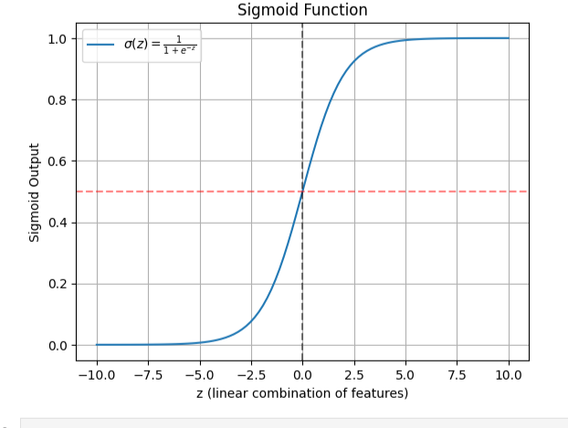

# Breast Cancer Classification with Logistic Regression

This project predicts whether a tumor is **malignant** or **benign** using the Breast Cancer Wisconsin dataset from Kaggle. The model is trained using **Logistic Regression**.

## 📌 Steps
1. Load and clean the dataset.
2. Split into training and testing sets.
3. Standardize the features.
4. Train a Logistic Regression model.
5. Evaluate using:
   - Confusion Matrix
   - Precision & Recall
   - ROC Curve and ROC-AUC score
6. Tune the classification threshold.
7. Explain and visualize the Sigmoid function.

## Sigmoid Function
The sigmoid function maps any real number into a value between 0 and 1 (probability):

\[
\sigma(z) = \frac{1}{1 + e^{-z}}
\]

### Sigmoid Plot


## Requirements
- Python 3
- pandas
- numpy
- scikit-learn
- matplotlib

## How to Run
```bash
# Install dependencies
pip install pandas numpy scikit-learn matplotlib

# Run the Jupyter Notebook
jupyter notebook breast_cancer_logistic_regression.ipynb
